# 01. Contexte système et cas d'usage

Ce diagramme présente les principaux acteurs du système et les cas d'usage fonctionnels majeurs d'AgriMétéo.

```mermaid
flowchart LR
    Guest[Visiteur]
    Beginner[Utilisateur debutant]
    Farmer[Agriculteur]
    Admin[Administrateur]

    subgraph AgriMeteo["Plateforme AgriMétéo"]
        UC1((Consulter le site marketing))
        UC2((Créer un compte))
        UC3((Se connecter avec email ou Google))
        UC4((Choisir un rôle utilisateur))
        UC5((Gérer son profil))
        UC6((Gérer ses cultures))
        UC7((Générer et suivre un plan de culture))
        UC8((Consulter la météo et les alertes))
        UC9((Recevoir des recommandations))
        UC10((Créer un rapport / diagnostic))
        UC11((Participer à la communauté))
        UC12((Consulter les notifications))
        UC13((Modifier ses paramètres))
        UC14((Consulter le dashboard admin))
        UC15((Gérer les utilisateurs))
        UC16((Gérer les permissions))
        UC17((Consulter les audits))
        UC18((Superviser contenus, rapports et météo))
    end

    Guest --> UC1
    Guest --> UC2
    Guest --> UC3

    Beginner --> UC3
    Beginner --> UC4
    Beginner --> UC5
    Beginner --> UC6
    Beginner --> UC7
    Beginner --> UC8
    Beginner --> UC9
    Beginner --> UC10
    Beginner --> UC11
    Beginner --> UC12
    Beginner --> UC13

    Farmer --> UC3
    Farmer --> UC5
    Farmer --> UC6
    Farmer --> UC7
    Farmer --> UC8
    Farmer --> UC9
    Farmer --> UC10
    Farmer --> UC11
    Farmer --> UC12
    Farmer --> UC13

    Admin --> UC3
    Admin --> UC5
    Admin --> UC14
    Admin --> UC15
    Admin --> UC16
    Admin --> UC17
    Admin --> UC18
```

## Lecture

- `Visiteur` interagit surtout avec le site et l'entrée dans la plateforme.
- `Utilisateur débutant` et `Agriculteur` partagent le noyau fonctionnel, avec des permissions différentes.
- `Administrateur` accède au back-office et aux fonctions de gouvernance.

