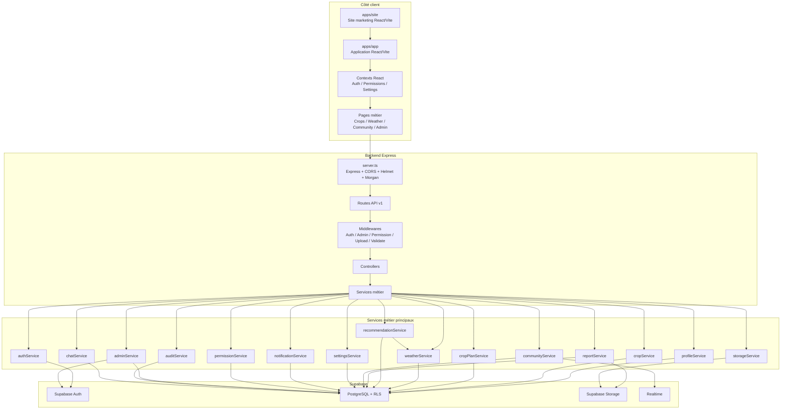

# 02. Diagramme de composants

Ce diagramme présente l'architecture logique du système telle qu'elle ressort du code.

## Lecture

- Le frontend principal dépend de trois contexts structurants : `Auth`, `Permissions`, `Settings`.
- Le backend suit une architecture classique `Routes -> Middlewares -> Controllers -> Services`.
- Supabase est au centre de l'infrastructure métier.

