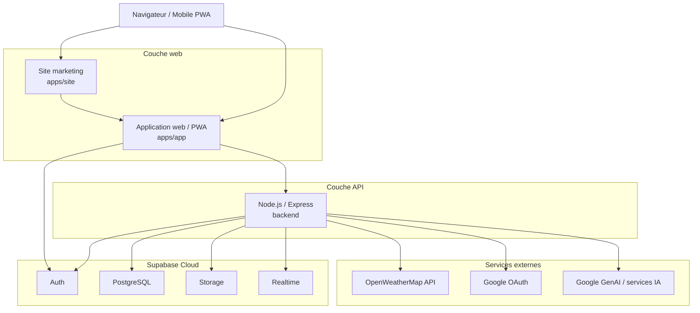

# 03. Diagramme de déploiement

Ce diagramme montre une cible de déploiement complète et réaliste pour AgriMétéo.

## Remarques

- Le site marketing peut être hébergé séparément de l'application.
- L'application frontend peut être déployée en PWA.
- Le backend centralise la logique métier et les intégrations externes.
- Supabase constitue le noyau de persistance et de sécurité.

