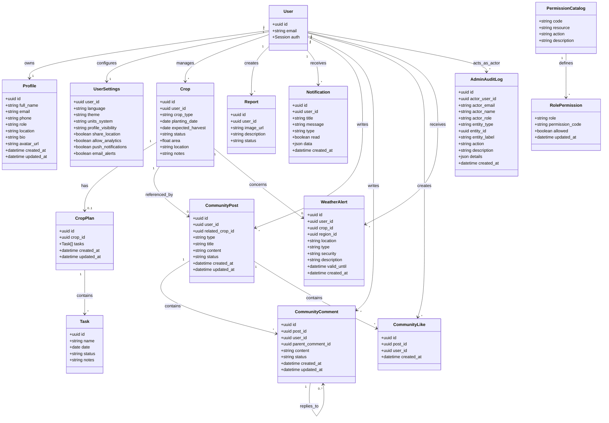

# 04. Diagramme de classes métier

Ce diagramme représente les principales entités métier et leurs relations.

## Remarques

- `User` représente l'identité d'authentification Supabase.
- `Profile` représente la projection métier de l'utilisateur dans l'application.
- `RolePermission` modélise le RBAC administrable.
- `AdminAuditLog` trace les opérations sensibles sur les entités principales.

