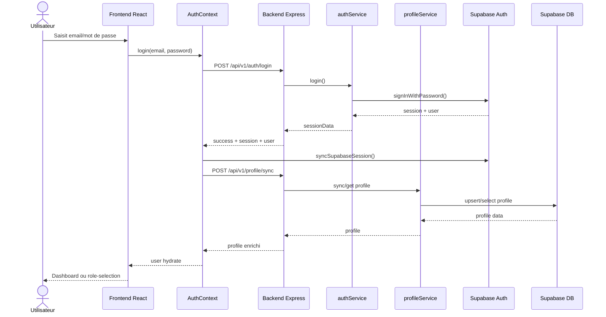

# 05. Séquence - authentification et synchronisation de profil

Cette séquence décrit le flux courant de connexion ou de récupération de session côté application.

## Variante Google OAuth

- L'utilisateur est redirigé vers Google via Supabase OAuth.
- À son retour, `completeOAuthSession()` récupère la session.
- Le même mécanisme `profile/sync` hydrate ensuite le profil applicatif.

