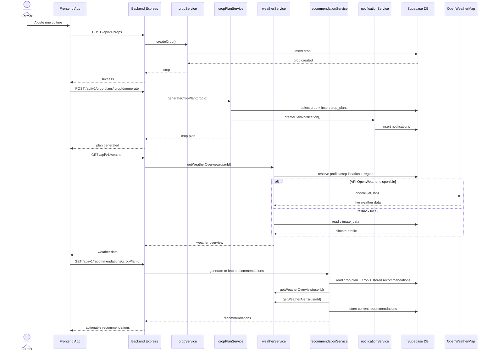

# 06. Séquence - culture, météo, recommandations et notifications

Cette séquence synthétise un flux métier important du projet : la culture alimente la météo, qui nourrit ensuite les recommandations et les alertes.

## Points clés

- Les plans de culture dépendent de la culture créée.
- Les recommandations agrègent plusieurs sources : crop, plan, météo, alertes, interventions récentes.
- La météo a une stratégie hybride : API externe si disponible, sinon fallback local.

