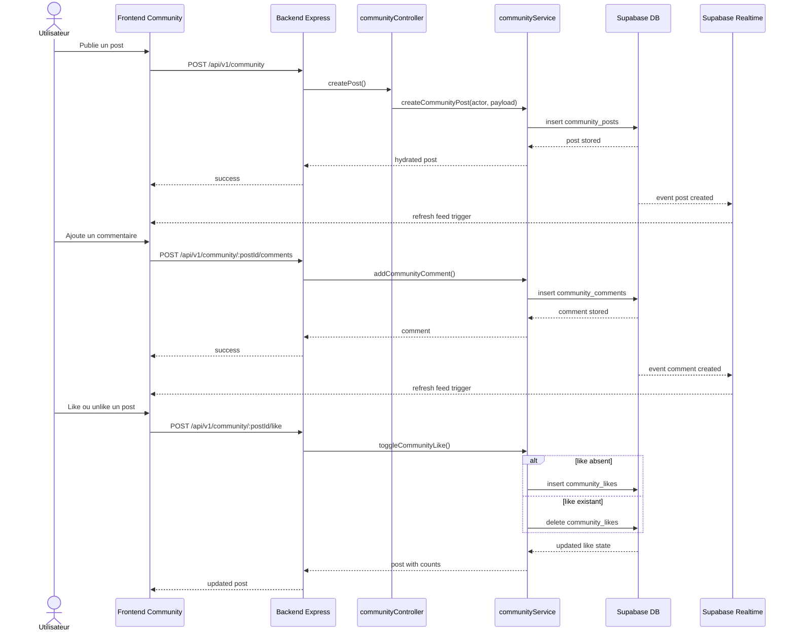

# 07. Séquence - interactions communautaires

Cette séquence couvre le flux principal de la communauté : publication, commentaire, like et rafraîchissement du feed.

## Remarques

- Les commentaires supportent une hiérarchie via `parent_comment_id`.
- Les likes sont contraints par l'unicité `(post_id, user_id)`.
- Le feed est pensé pour fonctionner avec Supabase Realtime.

