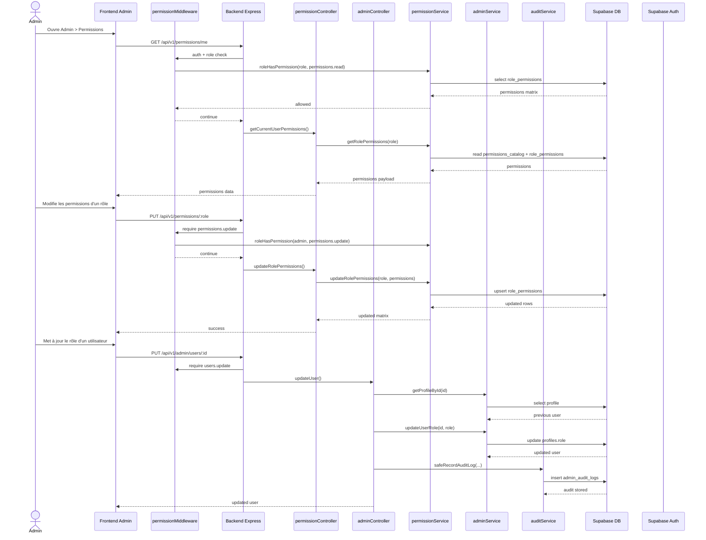

# 08. Séquence - administration, permissions et audit

Cette séquence montre comment la gouvernance admin fonctionne dans AgriMétéo.

## Points clés

- Les permissions admin sont dynamiques et stockées en base.
- Le middleware de permission protège les routes sensibles.
- Les actions de gouvernance peuvent être auditées via `admin_audit_logs`.

