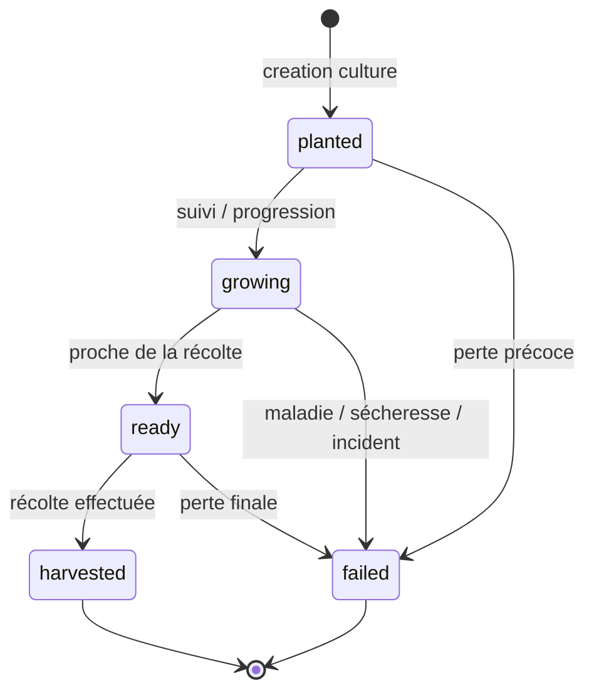

# 09. Diagramme d'états - cycle de vie d'une culture

Ce diagramme représente la logique de statut la plus importante côté culture.

## Interprétation

- `planted` correspond à une culture lancée et enregistrée.
- `growing` correspond à la phase active de croissance.
- `ready` représente une culture arrivée au stade de préparation de récolte.
- `harvested` clôt le cycle avec succès.
- `failed` clôt le cycle en cas d'échec agronomique.

